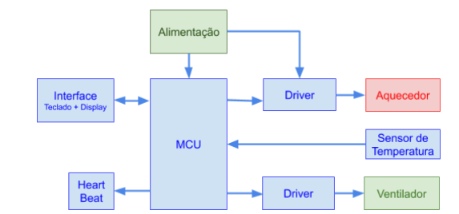
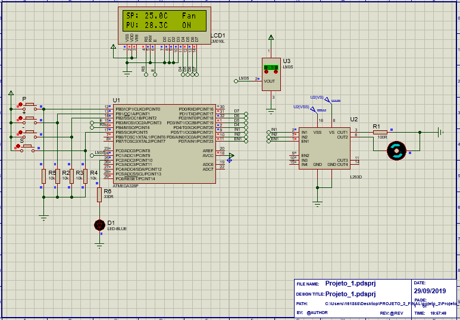

## Controlador Proporcional

* **Descrição geral do Sistema:**

   O controlador proporcional possui uma interface composta por display 16x2 e 4 botões (P | UP | DOWN | S). O controle é feito proporcionalmente e a configuração de alguns parâmetros do sistema é feita através da interface de usuário. Sâo elas:
      ** Novo set-point.**
      ** Valor do ganho do Heat.**
      ** Valor do ganho do Fan.**
      ** Ganho manual do Heat.**
      ** Ganho manual do Fan.**
      ** Desabilitar o controlador independentemente da temperatura.**

   

* **Funcionamento:**

   O sistema se inicializa na tela de estado do drive. Ao clicar no botão P é possível observar o estado atual do controlador, os valores de set-point e o valor da temperatura atual. Existem 6 telas, se o modo manual. Estando na tela desejada, estando na telas de ajuste de parametros é só clicar nos botões UP e DOWN para alterar valores. Para passar as telas é só dar um clique no botão P. Clicar no botão S nos modos manuais para ajustar os valores dos ganhos.

* **Periféricos:**
   * **Sensor:** O Sensor de temperatura utilizado é o sensor analógico LM35.
   * **MCU:** O MCU escolhido para o desenvolvimento foi o ATMega328p (Arduino) e ele é o responsável pelas tarefas de controle e interface do sistema. 
   * **L293D:** Ponte H utilizada para controlar ventilador e aquecedor.
   * **Ventilador:** Utilizado para o modo Fan.
   * **Aquecedor:** Utilizado para o modo Heat.

* **Software:**
   * **IDE:** Foi utilizada Sloeber, IDE do Eclipse para o Arduino.
   * **Bibliotecas utilizadas:** LiquidCrystal e Bounce2.
   * **Definições:** O arquivo */include/controles.h* contém todas as definições para parte de controle do PWM como parâmetros iniciais do controlador, o */include/lcd_telas.h* ID das telas da interface, o */include/heart_beat.h* tem as definições iniciais para a função heart beat, */include/botoes.h* contém todas as definições de GPIOs e as definições de funções.
   * **Arquivo .hex:** Ao compilar a aplicação, os arquivos .hex e .elf ficam localizados na pasta **Release**. 

 
* **Fotos:**

   

   

